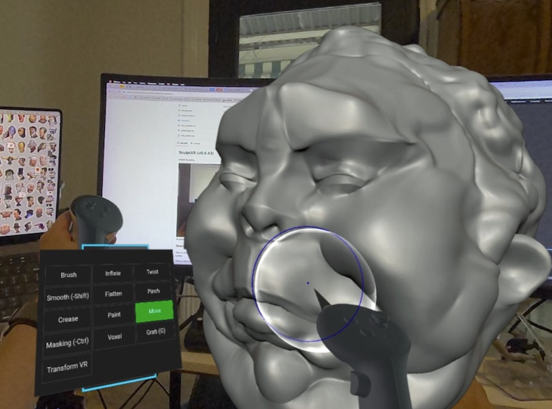
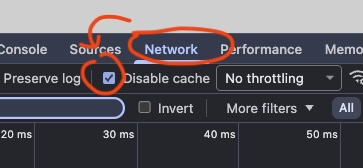
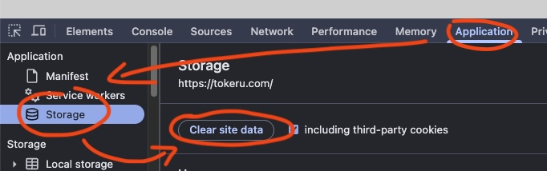
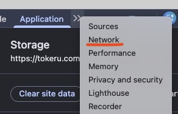

# SculptXR (v0.9.229)
WebXR Sculpting

 *SculptXR running natively on a Quest 3 in AR/passthrough mode.*

## Overview
This is a fork of [SculptGL](http://stephaneginier.com/sculptgl) focused on adding WebXR capabilities. It is entirely done using Antigravity, sorry code purists.

Watch a demo of the Feb 27 build [here.](https://www.youtube.com/watch?v=h7nVgpOmaXs)

Try the latest build [here!](https://tokeru.com/sculptxr/)

*   v0.9.217 - v0.9.229: **Voxel Cube Brush & Performance Optimization:** Added a new 'Cube' brush shape to the Voxel tool that can be oriented 1:1 with the physical VR controller. Offloaded all heavy Voxel normal calculations to the Web Worker and fixed a critical "Wireframe Rebuild Paradox" to permanently eliminate standalone CPU stuttering during rapid sculpting.
*   v0.9.209 - v0.9.216: **Wireframe Performance & UI Polish:** Restored the Voxel wireframe toggle with full quad support. Implemented dynamic line sub-sampling to instantly cure the severe standalone VR framerate drop caused by dense wireframes. Fixed overlay combobox translation math and eliminated UI rendering duplication.
*   v0.9.159 - v0.9.175: **Color Painting Polish:** Added a Color Smooth/Blur brush mapped to the secondary trigger, real-time contextual cursor color feedback for the Eyedropper, and hardware A-Button foreground/background color swapping.
*   v0.9.154 - v0.9.158: **Mini-HUD Layout Polish:** Adjusted the Mini-HUD 3D offsets for a more comfortable, symmetrical layout. Removed duplicate tools in the VR Combobox to achieve a perfect 3x5 button grid. Fixed a desynchronization bug with the Isolate Object toggle.
*   v0.9.150: **VR Controller Shortcuts:** The X-axis of the dominant thumbstick now directly controls Brush Intensity. Holding the secondary trigger now acts as a precision modifier, slowing down radius/intensity increments to exactly 10% speed for fine-tuning.
*   v0.9.144: **In-App Function Profiling:** Added a native VR Deep Profiler and HUD Logger to capture and display sub-millisecond execution times directly in the WebXR view, bypassing the need for remote debugging on standalone headsets.
*   v0.9.106: **Drag Tool Hotfix:** Corrected VR cursor radius scaling and prevented missing history TypeError on initial stroke.
*   v0.9.105: **Drag Tool Symmetry Hotfix:** Fixed an issue where the symmetric brush wouldn't update its position in VR, preventing symmetric drag strokes from following the geometry.
*   v0.9.104: **Drag Tool Hotfix:** Fixed a crash where the VR Drag tool would try to push a stroke state during hover tracking.
*   v0.9.103: **Drag Tool Restored:** Re-enabled the classic 'Snakehook' style Drag brush. Upgraded its core math to utilize modern `Move.js` symmetry blending (preventing mesh tearing) and stabilized its VR 1:1 controller tracking.
*   v0.9.102: **Mini-HUD Polish:** Tool picker combobox now features categorized color-tinting (Red, Blue, Purple, Green, Orange) to quickly identify brush families in VR. Extraneous keyboard shortcut labels have been stripped from the VR UI.
*   v0.9.94: **Mini-HUD Polish:** Fixed AR clipping interactions, default brush radii normalization, and tool selection event bleeding. Stripped out noisy UI debug logging.
*   v0.9.85: Color Picker: Paint Tool FG/BG Color Swatch and Mini-HUD Color Picker Support.
*   v0.9.83: VR Input: Long distance 'Aim' mode sculpting and symmetry fully supported.
*   v0.9.71: VR Polish: VR Move brush now correctly respects intensity slider for displacement and rotation.

[View Full Release History](docs/releases.md)

## Supported Platforms
It should work on any WebXR compatible device. So far I've tested on:
- Quest 2 and Quest 3 browser in standalone
- Google Chrome on Windows PCVR via Meta Link and Quest 3

## Instructions
### Basics
Press the 'Enter VR' button. If you're on a device that supports passthrough, press the 'Enter AR' button.

The right controller is the primary sculpting tool. The left controller contains a mini menu to change tool, radius, intensity, negative mode, toggle wireframe.

Right trigger will sculpt. Holding down left trigger while using right trigger will smooth.

The A button will engage 'negative' mode, so a brush build up will become a brush carve for example.

The X button will launch the full VR Menu.

Pushing the left controller thumbstick left/right will undo/redo.

Pushing the right controller thumbstick up/down will change radius.

Grip controls should work as expected, single grip will rotate/translate, both grip controls will scale the world.

Saving and loading will often pop up a dialog in non-vr mode. If you choose an option and see nothing, tap the meta button to drop back into 2d mode, you'll probably find a file dialog waiting for you.

If you're left handed, you can swap the controllers from the **Settings** menu.

### Voxels

In the tool combobox is a Voxel tool. This is a basic 'air draw toothpaste in 3d' tool like Adobe Medium, it has a sub palette of 4 modes, add, sub, inflate, deflate. It also lets you change the voxel resolution, and 'bake to mesh' will convert the voxel to regular polygons for further sculpting.

### Desktop spectator mode

If running on PCVR, the desktop will be in a spectator mode. It is a live preview of your sculpt from a stationary camera. You can move this camera with the regular mouse/tablet controls, and use the desktop sculpting tools. This means if there are certain operations easier to do in desktop, you can swap between them easily.

In the desktop UI under Camera -> Spectator mode, you can decide how the desktop mode should behave:

- **VR View (Mirror)** - a direct mirror of the VR view.
- **Desktop** - the standard view, a stationary view that can be controlled independantly of the VR view
- **Tracked** - A hybrid of VR View and desktop; it will match the orientation and scale of the VR View, but can be offset, and because it doesn't inherit translation, isn't as jittery or motion sickness inducing. Good for demos, working with a general audience.
- **Stationary (6DOF)** - Inspired by Dreams on the Playstation, this mode lets you use 6dof controllers with your monitor. More details below.

### Stationary (6DOF) Dreams mode
Before starting, cover the light sensor in the quest headset with something opaque (it's inside the headset between the lenses). 

Start SculptXR, Enter VR. Now remove the headset, and place it on your desk facing you. Make sure its slightly off the edge of the desk so that the lower fisheye cameras can see the floor.

Select Stationary (6DOF) from the Camera -> Spectator on desktop, sit back at least 50cm from the headset.

You should now see the sculpt and your controllers on screen. Start sculpting! It takes a little time to get used to without the stereo cues, use the radius circle indicator and the spherical indicator to judge your depth.

If the default position feels uncomfortable (too high, too far away, too shifted left or right), use the mouse to adjust. Scrollwheel will move near/far, middle mouse will pan up/down/left/right. 

My usual method is to adjust the view with the mouse so that the controllers feel comfortable in my lap, then use the grip controls to pull the sculpt into a comfortable position.

#### Stationary mode and tracking issues
My understanding is the Quest 3 makes a few (perfectly valid!) assumptions about tracking:

- It can always see the floor
- The headset is always moving a little bit so it can keep getting updates on where it is
- The controllers are held in a natural grip out front, below, with the 'face' of the controller facing the cameras.

When I first tested this Dreams mode putting the headset on my desk, I kept having the controllers drift and act strange. I eventually realised what was happening:

- It couldn't see the floor
- The headset was perfectly static, so it wasn't getting regular updates of where it was in space
- The controllers were showing their backside to the cameras, and often either too close or off to the sides near the headset 'ears'.

The Quest 3 is simply not designed for this tracking scenario. Hence you gotta help it a little. When placing it on your desk, ensure it's hanging off the edge a little so the cameras can see the floor. Careful, the quest 3 is  front heavy and likes to tip forward! If you have a way to mount it higher with more stability, perfect. 

By shifting yourself further back, you're more likely to keep the controllers in sight of the cameras at all times.

Despite not being designed to track the back of the controllers, the Quest 3 does a pretty good job. I find if controllers start to drift (usually because I've kept the controllers in a hard to track position for too long), just 'showing the face' of the controllers to the headset by tilting them forward for a second will reset tracking.

#### Stationary mode and standby
The quest 3 will go into standby mode if it thinks you're not using it. Covering the light sensor helps trick it, but if the headset hasn't moved for 2 minutes, it assumes it's not on your head and goes into standby. Currently I just tap or nudge the headset every 30 seconds. There are developer options to better control this, but I haven't tested them.

## Clear Browser Cache
The browser on the Quest 3 and Chrome desktop love to aggresively cache javascript files. This plays havok with SculptXR where I'm frequently updating files.

Here's what I do to clear the cache.

### Desktop Chrome

1. R.click on the page, Inspect
2. Network tab, 'Disable Cache' toggle, turn it on.
3. Application tab, Storage, 'Clear site data'
4. If the Inspect tab doesn't have enough room, the Network or Applications tab might be under the >> button in the top bar.

 *Network, Disable Cache* 

 *Application, Storage, Clear site data* 

 *Options sometimes hidden under >> menu* 

### Quest 3 browser

1. Click the 3 dots button in the top right of the browser
2. Clear Browsing Data
3. Clear Data

## Original Project Resources
- Live Demo: [stephaneginier.com/sculptgl](http://stephaneginier.com/sculptgl)
- Website: [stephaneginier.com](http://stephaneginier.com/)

## Credits
- Original SculptGL by [Stéphane Ginier](http://stephaneginier.com/).
- Raw environments from [HDRI Haven](https://hdrihaven.com/hdris).
