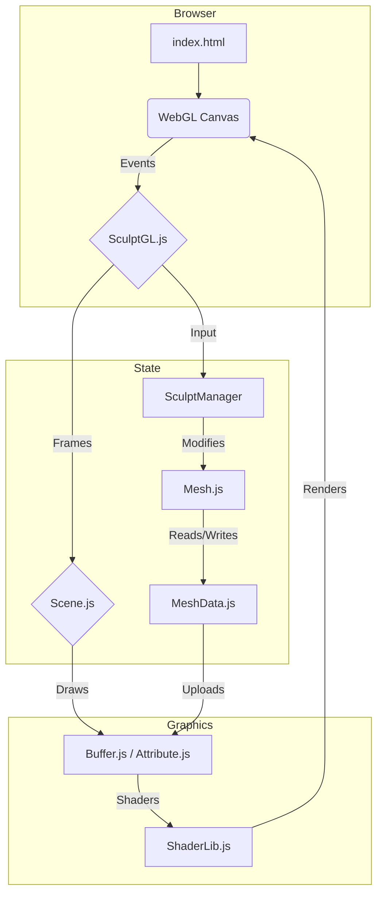

# Application Architecture Overview

This document provides a high-level overview of the SculptXR codebase. Structurally, the app follows an event-driven architecture that manages a central 3D scene, highly optimized mesh data structures, and a custom WebGL rendering pipeline.

## 1. Core Entry and Scene Management
The application boots via `index.html`, which establishes the WebGL canvas, loads core dependencies, and initializes `SculptGL.js`.

### `SculptGL.js` (The Interaction Controller)
This is the primary subclass of `Scene` and acts as the interaction hub.
- It captures all Desktop inputs (Mouse, Keyboard, Touch/Hammer.js gestures).
- Maps inputs to high-level system states like `CAMERA_PAN`, `CAMERA_ZOOM`, or forwards editing signals to the `SculptManager`.
- Exposes developer debugging tools directly to the `window` object (e.g., `window.debug`. `window.setGizmoScale`).

### `Scene.js` (The Render Loop & VR State)
This class holds the entire "world" state.
- **Render Loop:** It manages `applyRender()`, the core heartbeat of the application. It coordinates standard Desktop rendering alongside VR rendering (`onXRFrame`).
- **XR State:** It manages the `xrSession`, tracking the world offsets (`_xrWorldOffset`), the universal VR spectator scale (`_vrScale`), and controller poses.
- **Pass Management:** It handles RTT (Render To Texture) passes for post-processing effects like FXAA, wireframe blending, and contour lines.
- **Object Registry:** It owns the arrays holding the geometry (`_meshes`), the camera, and the UI systems (`_gui`, `_guiXR`).

## 2. The Data Layer: Topology and Meshing
SculptXR uses a bespoke, highly optimized data structure optimized for rapid localized topology changes (e.g., sculpting, dynamic tessellation, remeshing) rather than relying on a generic scenegraph like Three.js.

### `MeshData.js` (The Raw Arrays)
This acts as a struct containing purely flat typed arrays (Float32Array, Uint32Array, etc.).
- Maintains vertices (`_verticesXYZ`), normals, UVs (`_texCoordsST`), and colors.
- More importantly, it maintains complex connectivity arrays for traversal:
  - `_vertRingFace`: Which faces touch a vertex.
  - `_vertRingVert`: Which vertices are connected by an edge.
- Maintains spatial partitioning data for the `Octree`.

### `Mesh.js` (The Logic Wrapper)
This class wraps `MeshData` with the logic required to manipulate and query the geometry.
- Provides functions to update topology (`initTopology`, `initFaceRings`).
- Contains methods that update segments of the mesh based on localized sculpting operations (dirty flags).
- Connects the raw data to the `RenderData` required for WebGL buffer updates.

## 3. The Render Pipeline
The rendering system is custom-built on top of raw WebGL, circumventing heavy abstraction layers to ensure fast updates for rapidly changing meshes.

- **`Buffer.js` & `Attribute.js`:** Thin wrappers around WebGL buffer bindings. They are heavily optimized to use `gl.DYNAMIC_DRAW` or `gl.bufferSubData` allowing the engine to only upload the modified chunks of a mesh to the GPU after a brush stroke, rather than re-uploading the entire model.
- **`ShaderLib.js`:** A registry of all custom GLSL shaders (PBR, Matcap, Flat, Selection, post-processing FXAA, etc.).

## 4. Summary of the Lifecycle (The Render Loop)
1. **Input:** `SculptGL` captures an event (e.g., a mouse drag or VR controller movement).
2. **Action:** If the input triggers a sculpt operation, `SculptGL` informs `SculptManager`, which alters the active `Mesh` via specific tool logic (e.g., `SculptVoxel`).
3. **Data Modification:** The tool alters specific vertices in `MeshData`. The `Mesh` class updates its local topology and bounding box octree.
4. **Buffer Upload:** The modified segment of `MeshData` is uploaded to the GPU via `Buffer.js`.
5. **Draw:** `Scene.requestRender()` triggers `applyRender()`. The scene is drawn using the appropriate shaders from `ShaderLib`, applying post-processing passes like FXAA or Merge.

### Architecture Diagram

