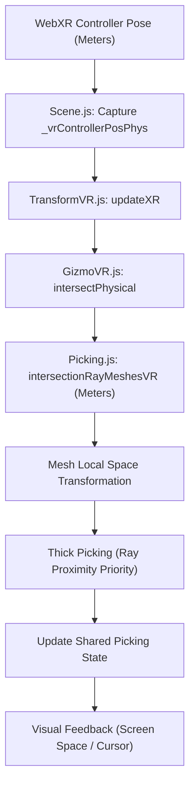

# Gizmo VR Raycasting & Aiming Fix

This document outlines the architectural shift and critical bug fixes that finally resolved the unreliable GizmoVR interaction in VR (v0.7.641 - v0.7.644).

## The Core Strategy: Physical World Space

Previous attempts failed primarily due to inconsistent unit scaling and coordinate space mismatches (Camera Space vs. World Space vs. Screen Space). The successful fix relies on a "Physical First" approach:

1.  **Coordinate Unification**: All raycasting and intersection calculations are now performed in **Physical World Space (Meters)**.
2.  **Transformation Parity**: Raw controller poses (`_vrControllerPosPhys` and `_vrControllerDirPhys`) are captured directly from WebXR in meters and passed to the intersection logic without intermediate "Engine Space" conversions.
3.  **Physical Radius**: Interaction "thickness" is defined in meters (e.g., 0.05m / 5cm radius), ensuring consistent feel regardless of the world's `vrScale`.

## Key Technical Insights & Fixes

### 1. The Temporal Variable Corruption (Picking.js)
The most elusive bug was the corruption of shared temporal variables in `Picking.js`. 
- **The Bug**: `intersectionRayMeshesVR` was transforming the ray into each mesh's local space using `_TMP_NEAR` and `_TMP_FAR`. However, inner functions like `intersectionRayMeshThick` were also using or modifying these variables (or related ones like `_TMP_INTER_1` and `_TMP_DIR_PICK`).
- **The Result**: As soon as the ray was tested against the first mesh in a gizmo, the global temporary state was garbled, causing subsequent meshes to see a "corrupted" ray or report intersection points at the world origin `(0,0,0)`.
- **The Fix**: Introduced dedicated, isolated temporary variables (`_TMP_NEAR_1`, `_TMP_FAR_1`, `_TMP_INTER_CORRECTED`) to protect the source ray during the mesh iteration loop.

### 2. Ray Smoothing: Ray Proximity vs. Camera Distance
- **The Problem**: In "Thick Picking" (segments/edges), the logic originally prioritized the hit **closest to the camera**. On high-poly rings (tori), small adjacent edges would compete for priority based on tiny camera-distance differences, causing the cursor to "jitter" or "step" rapidly as you aimed.
- **The Insight**: For aiming (lasers), the user cares about what the laser is **pointing at**, not what is closest to them.
- **The Fix**: Changed `intersectionRayMeshThick` to prioritize the hit with the **smallest geometric distance to the ray**. This provided perfect "magnetic" snapping that follows the laser beam smoothly.

### 3. Forward Direction Guard
- **The Bug**: `intersectionRayMeshThick` calculates distance between the ray segment and mesh edges. Geometrically, this segment is infinite unless guarded.
- **The Fix**: Implemented a mandatory `vec3.dot(hitPosition - rayOrigin, rayDirection) > 0` check. This prevents "phantom hits" behind the controller.

### 4. Visibility & Culling
- **Insight**: Gizmo handles (like planes) are often viewed from "inside" or from angles where backface culling makes them invisible in VR.
- **Fix**: Disabled `GL_CULL_FACE` specifically for the Gizmo render pass and ensured it uses a double-sided intersection check.

## Architecture Diagram (Simplified)

## Summary for Maintenance
Wait to scale until the very end. Perform all logic in meters, then convert the final `intersectionPoint` and `radius` back to "Engine Units" only for the legacy rendering pipeline and visual UI elements (like the brush ring). **Protect your temporal variables in `Picking.js` like shared memory.**
