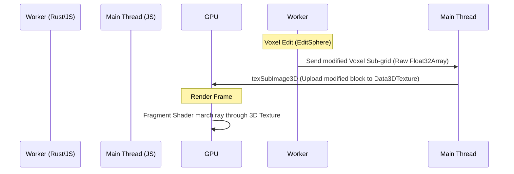

# Implementation Plan: GPU Volume Raymarching for SculptXR

This plan outlines shifting the voxel rendering pipeline from CPU-generated meshes (Surface Nets) to **Real-time GPU Volume Raymarching** using WebGL 2.0 `Data3DTexture`. This will resolve the $500$ms Three.js rendering bottlenecks.

## Current Bottleneck
- **Worker**: Generates meshes in $10$-$15$ms (Fast!).
- **Main Thread**: Takes $500$ms to process and draw thousands of vertices via Three.js `WebGLRenderer.render` (Slow!).
- **Root Cause**: High draw call counts and heavy geometry upload overhead for small chunks.

## Shifting the Paradigm: Option 2 (GPU Raymarching)

Instead of generating vertices on the CPU and uploading them, we upload the raw **Distance Field** to the GPU once as a 3D texture and let the Fragment Shader draw it.

### 1. Data Flow Overhaul



### 2. Main Thread Setup

We define a single large `THREE.BoxGeometry` that bounds the workspace. We apply a custom `THREE.ShaderMaterial` to it.

```javascript
// Pseudo Code for Material
const volumeTexture = new THREE.Data3DTexture(floatData, res, res, res);
volumeTexture.format = THREE.RedFormat;
volumeTexture.type = THREE.FloatType;
volumeTexture.minFilter = THREE.LinearFilter;
volumeTexture.magFilter = THREE.LinearFilter;
volumeTexture.needsUpdate = true;

const material = new THREE.ShaderMaterial({
  vertexShader: volumeVert,
  fragmentShader: volumeFrag,
  uniforms: {
    u_volumeTex: { value: volumeTexture },
    u_res: { value: res },
    u_step: { value: step },
    ...
  },
  transparent: true,
  side: THREE.BackSide // Render inside of box if camera enters!
});
```

### 3. Shader Logic (The Engine)

The Fragment Shader is where the magic happens:

1.  **Ray-AABB Intersection**: Determine where the view ray enters the bounding box.
2.  **Ray Marching Loop**: Step along the ray in world space.
3.  **Texture Sampling**: At each step, sample `u_volumeTex` (bilinear interpolation happens automatically on the GPU!).
4.  **Zero-Crossing Check**: If `distance <= 0.0`, we hit the surface!
5.  **Normal Estimation**: Sample $6$ neighboring texels to compute the gradient (Central Differences) for shading!
6.  **Lighting**: Apply Matcap or standard PBR shading.

## Advantages
- **Zero Vertices**: Tiny memory footprint for display.
- **Zero Heavy Draw Calls**: One single box draw call per workspace.
- **Consistent Frame Rate**: Frame rate is independent of mesh complexity (only dependent on viewport resolution scale).

## Tasks & Milestones

- [ ] Disable `SurfaceNets` mesh generation in `VoxelWorker.js` for display (keep it only for export).
- [ ] Implement raw `Float32Array` sub-grid transfer from Worker to Main Thread.
- [ ] Create `Data3DTexture` in `SculptVoxel.js` (Main Thread).
- [ ] Write the Raymarching Fragment Shader.
- [ ] Integrate with Three.js scene as a single Bounding Box.

> [!IMPORTANT]
> This is a non-trivial architectural upgrade that requires WebGL 2.0 capabilities (standard on modern headsets/browsers). It will decouple rendering lag from sculpting complexity.

Proceed to next phase if approved.
